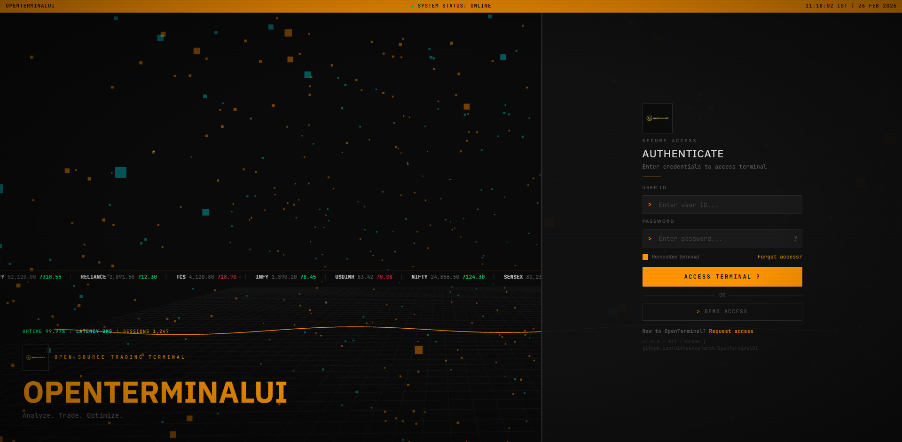
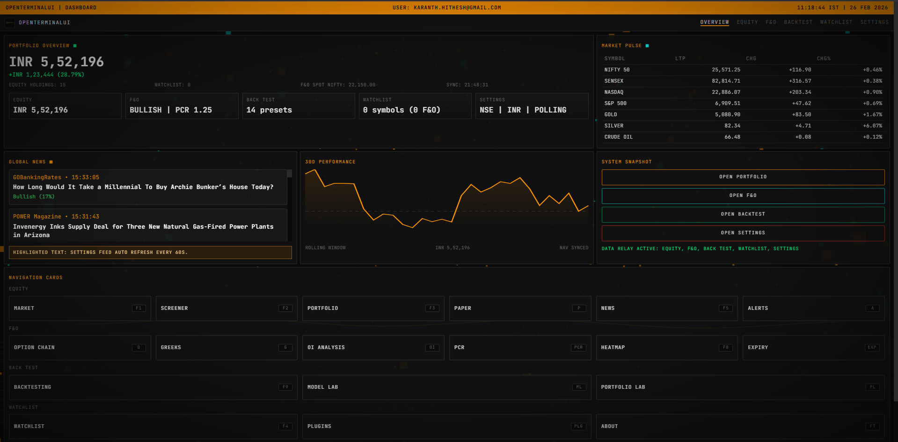
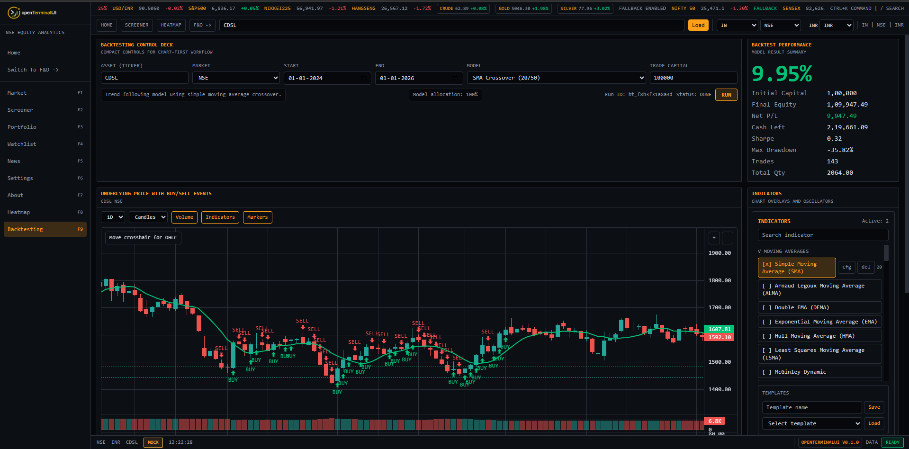
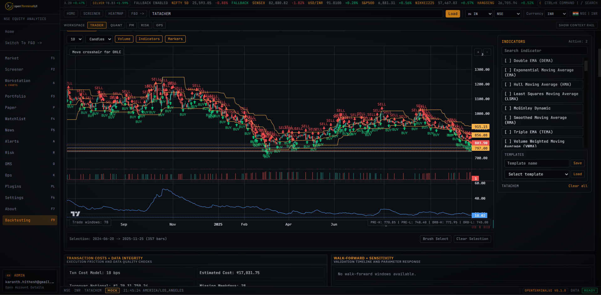
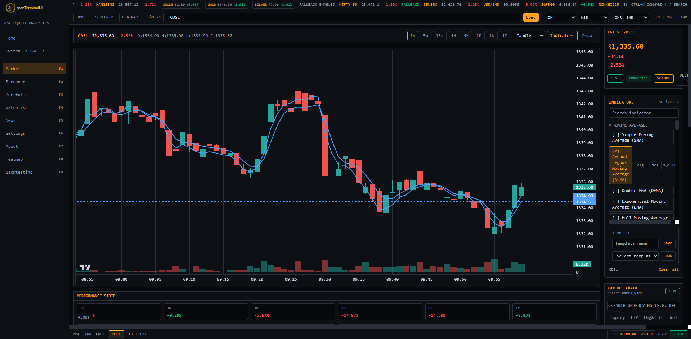
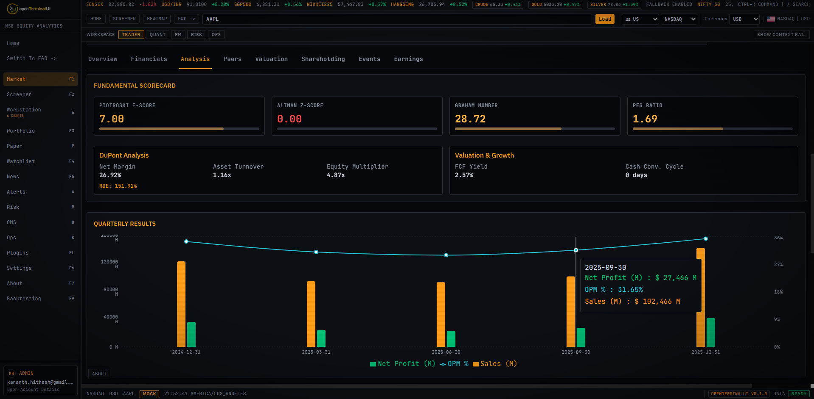
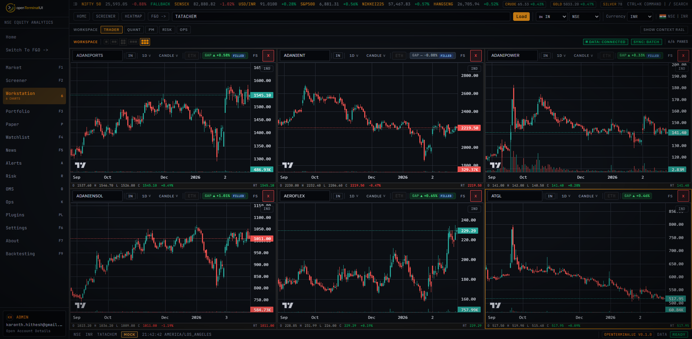
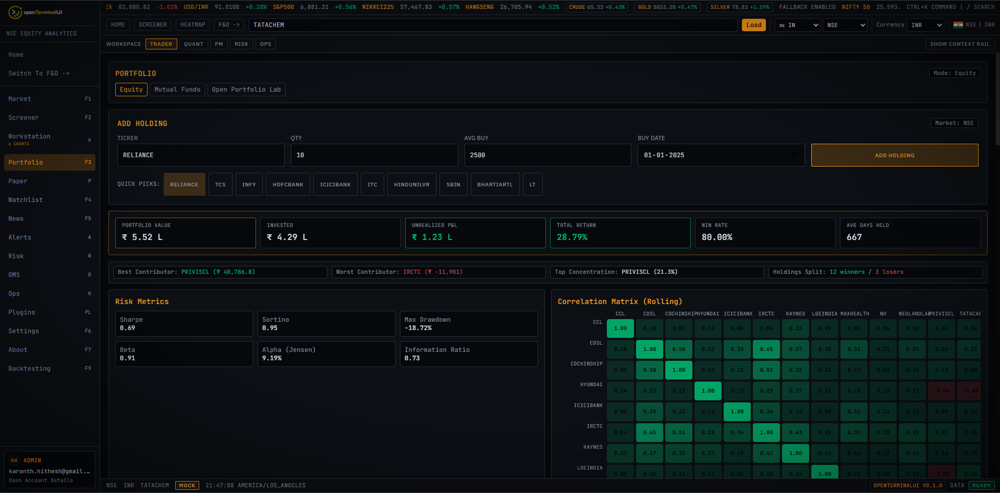

<p align="center">
  
</p>

<p align="center">
  <strong>Analyze. Trade. Optimize.</strong><br>
  Open-source Indian and US stock trading analytics workspace
</p>

<p align="center">
  
  
  
  
  
  
</p>

---

## Project overview

OpenTerminalUI is a terminal-style market analysis workspace organized around three connected operating areas:

## Terminal Noir UI Status

The Bloomberg-inspired **Terminal Noir** overhaul is now integrated into the main shell:

- `CommandBar` (GO bar) with command parsing, shortcuts, and autocomplete
- top `TickerTape` with seamless **infinite scroll** and real-time global indices (NASDAQ, DOW, FTSE, DAX, Nikkei)
- `Launchpad` multi-panel workspace with panel linking and presets
- `SecurityHub` (DES-style) with dense tabbed security views and **Multi-Symbol Chart Comparison** (Overlay Mode)
- `DenseTable` reusable high-density table component across screener/portfolio flows
- chart/workstation context actions, including quick **Add to Portfolio**
- **Keyboard Navigation System** (Ctrl+G, Ctrl+W, Ctrl+N, Ctrl+P, Ctrl+B) for a keyboard-first professional workflow

Primary routes to validate quickly:

- `/equity/stocks`
- `/equity/security/:ticker`
- `/equity/launchpad`
- `/equity/economics` (New: Calendar + Macro Dashboard)
- `/equity/yield-curve` (New: US Treasury Yield Curve)
- `/equity/sector-rotation` (New: RRG Map)
- `/equity/chart-workstation`
- `/equity/compare`
- `/equity/screener`
- `/equity/portfolio?view=manager`

### Equity & Fundamental Analysis Pack
- **Chart Workstation** - multi-timeframe charts with unified India/US OHLCV routing, indicator overlays, delivery overlay, history backfill, and **Incremental Realtime Candle Updates**
- **Economic Terminal** - Global economic calendar with impact-coding and a Macro Dashboard tracking US, India, EU, and China indicators (GDP, CPI, Rates)
- **Sector Rotation (RRG)** - Visual relative rotation graph using JdK RS-Ratio and RS-Momentum to track sector leading/lagging cycles
- **Fixed Income** - Live US Treasury Yield Curve dashboard with historical curve overlays and automatic inversion detection
- **AI Research Copilot** - Natural Language Query engine in the GO bar; translates plain English to data queries, screener filters, and chart commands
- **Insider Trading Monitor** - Tracks SEC Form 4 and NSE disclosures with cluster detection and chart event markers
- **Company Analytics** - fundamentals, scorecards, trends, reports, valuation, peer comparison
- **Operations Screens** - revamped screener (presets/saved/public screens + viz), **Multi-Watchlist System** with Heatmap mode, portfolio, mutual funds desk, settings, and news/sentiment flows
- **US Market Integration** - NYSE/NASDAQ/AMEX market support with market-aware symbol routing and normalized chart endpoint support

### Futures & Options (F&O) Analysis Pack
- **US Stock Options Support** - Fully extended F&O pack to support US tickers via FMP/Yahoo adapters with unified routing
- **Option Chain + Greeks + OI** - strike-level structure, **Color-Coded Greeks** (Delta, Theta), and open-interest context
- **Strategy Builder** - multi-leg payoff analysis with preset templates
- **IV Analytics** - Real-time Implied Volatility Rank and Percentile tracking for all underlyings
- **PCR + Heatmap + Expiry Dashboards** - breadth, participation, and expiry-focused signals
- **Futures Terminal** - shared chart/indicator stack + realtime quote stream with Equity for consistent workflow
- **Unified Context** - cross-pack ticker/navigation continuity between Equity and F&O screens with common terminal shell primitives

### Backtesting Control Deck
- **Intraday Support** - Sub-daily backtesting (1m, 5m, 15m, 1h) with session-aware signal generation and execution
- **Vectorized Engine** - Performance-optimized NumPy engine capable of processing 100k+ intraday bars in <1s
- **Asset + Capital Inputs** - user-defined asset and trade capital at run start
- **Model Presets + Custom Script** - built-in strategies or custom Python `generate_signals(df, context)`
- **Capital-aware Execution** - model allocation determines share quantity against available capital
- **Result Accounting** - initial capital, final equity, net P/L, and ending cash shown in performance block
- **Execution model** - configurable fill delay and intraday spread-aware slippage modeling
- **Trade Audit** - buy/sell markers, execution logs, and full trade blotter by asset

### Model Lab
- **Experiment Registry** - first-class experiment objects with tags, model params, date windows, benchmark, and cost model
- **Research Reports** - persisted metrics/timeseries tear-sheet with equity, drawdown, rolling sharpe, monthly heatmap, and return distribution
- **Run Comparison** - multi-run compare table, curve overlays, scatter plots, and Pareto highlighting
- **Robustness Tools** - walk-forward validation and bounded parameter sweep endpoints

### Portfolio Lab
- **Portfolio Definitions** - reusable universes with rebalance policy, weighting method, constraints, and benchmark
- **Strategy Blending** - multi-model blend registry (weighted return blending MVP)
- **Portfolio Backtesting** - portfolio-level orchestration across many assets and blended strategy streams
- **Institutional Analytics** - equity/drawdown, rolling metrics, contribution and turnover series, monthly heatmap, and correlation matrix

### Risk, OMS & Governance Pack
- **Risk Engine** - portfolio VaR/CVaR, backtest risk attribution, and configurable stress scenario analysis
- **Risk Compute Module** - EWMA volatility, beta, rolling correlation, and PCA factor decomposition endpoints
- **Execution Simulator** - transaction cost modeling with commission, slippage, spread, and market-impact parameters integrated into backtest runs
- **OMS / Compliance** - order lifecycle management, fill tracking, restricted-list enforcement, and full audit log
- **Model Governance** - run registration with code hash + data version binding, multi-run comparison, and model promotion workflow
- **Ops Dashboard** - real-time data feed health monitoring and kill-switch controls
- **Technical Screener** - pattern-based screener engine with breakout scanner and real-time scanner alert delivery

### Quant Analytics Pack

- **Cockpit Dashboard** - aggregated ops view: portfolio snapshot, signal summary, risk summary, upcoming events, and latest news in one screen
- **Portfolio Backtest Jobs** - async job-based portfolio backtesting: submit job, poll status, retrieve equity curve, drawdown, turnover, and metrics
- **Experiment Registry** - named experiments with config, code hash + data hash binding, compare table, delta scoring, and paper-promotion workflow
- **Instrument Search** - cross-exchange canonical instrument lookup with exact-match → prefix → fuzzy ranked results
- **Data Quality** - scan-based data quality monitoring: run scans per dataset, track history, and aggregate dashboard
- **TCA (Transaction Cost Analysis)** - paper trading execution cost breakdown: fills, gross P&L, commission, slippage, and net P&L per lot

### Platform & APIs
- **Redis Quote Bus** - High-performance Pub/Sub quote distribution enabling horizontal scaling of backend instances
- **Distributed Bar Aggregation** - Redis-locked aggregator role for consistent 1-min bar construction across nodes
- **Realtime Streaming** - WebSocket quotes with 5-second market-status broadcasts and REST fallback
- **Advanced Export** - Bloomberg-quality PDF research reports, Excel, and CSV generation for stocks, portfolios, and backtest results
- **V1 Endpoints** - equity analytics, shareholding pattern/trends, mutual fund search/performance/portfolio, delivery series, indicators, crypto, scripting
- **UI Reliability** - hardened chart/indicator pipelines for first-load and timeframe-switch stability
- **Market Classification** - country/exchange badges, currency metadata, and instrument capability tags (F/O)
- **Background Services** - instruments loader and scheduled news ingestion
- **Deployment** - Docker compose workflow with required Redis service for horizontal scale

## Features

- **Authentication foundation**: JWT access/refresh flow, auth middleware, role checks, and auth pages/context in frontend.
- **Events + earnings expansion**: corporate actions/events endpoints, earnings calendar + analysis services, and timeline/calendar UI widgets.
- **Alert engine v2**: user-scoped alert rules, evaluator service on tick stream, alert history, REST CRUD, and websocket alert channel (`/api/ws/alerts`).
- **Paper trading module**: virtual portfolios, orders, positions, trades, performance metrics, strategy deploy endpoint, and new Paper dashboard UI.
- **Charting persistence/sync foundation**: chart drawings/templates backend APIs and crosshair sync context scaffolding for multi-panel charts.
- **Multi-exchange adapter framework**: pluggable adapter base + registry (`Kite`, `Yahoo`, `Crypto`) with adapter-first routing in key quote/search/chart flows.
- **US stock ticker integration**: autocomplete + market-aware symbol routing for US tickers across charting and backtesting flows.
- **Plugin system**: sandboxed plugin loader with YAML manifests, permission registry, enable/disable lifecycle, example plugins (RSI divergence scanner, unusual volume detector, sector rotation monitor), backend + frontend marketplace UI.
- **Export engine**: PDF, Excel (`.xlsx`), and CSV report generation for portfolio holdings, watchlist snapshots, and analytics data via `reportlab` and `openpyxl`.
- **Portfolio analytics suite**: benchmark overlay charting, correlation heatmap, dividend income tracker, risk metrics panel (Sharpe, Sortino, max drawdown), and tax lot manager.
- **PWA + mobile experience**: web app manifest, service worker with offline caching, app install prompt banner, mobile bottom navigation bar, responsive card layouts, and pull-to-refresh touch gestures on watchlist and alerts.
- **Theme system**: terminal theme CSS layer imported at app root with customizable accent colours exposed in settings.
- **E2E mobile tests**: Playwright test suite covering swipe interactions, touch targets, and responsive breakpoint behaviour.
- **New dependencies**: `openpyxl` and `reportlab` for server-side report generation.
- **Technical Screener**: pattern-based screener rules engine and breakout scanner with real-time scanner alert delivery.
- **Institutional data layer**: point-in-time data versions, corporate actions service, EOD price series, and PIT fundamentals with DB migration `0004`.
- **Risk Engine**: portfolio-level VaR/CVaR, backtest risk attribution, and configurable stress scenarios via `/api/risk/`.
- **Execution Simulator**: transaction cost model (commission, slippage, bid-ask spread, market impact) integrated into backtest runs via `execution_profile`.
- **OMS / Compliance**: order management with fill tracking, restricted-list enforcement, and audit log via `/api/oms/` and `/api/audit`.
- **Model Governance**: run registration with code hash + data version binding, multi-run comparison, and model promotion via `/api/governance/`.
- **Ops Dashboard**: feed health status and kill-switch controls via `/api/ops/`; new Ops Dashboard UI page.
- **Quant Analytics Pack**: cockpit summary aggregator, async portfolio backtest jobs, risk compute module (EWMA vol, beta, correlation, PCA), experiment registry with hash-bound configs, cross-exchange instrument search, data quality scan dashboard, and paper trading TCA breakdown.
- **Cockpit Dashboard UI**: new frontend page aggregating portfolio snapshot, signal summary, risk summary, events, and news into a single quant ops view.

## Roadmap

- [x] Equity terminal with charting, research panels, and operational workflows
- [x] F&O terminal with option chain, Greeks, OI, strategy, PCR, heatmap, and expiry views
- [x] Capital-aware backtesting control deck with model-based execution sizing
- [x] Model Lab experiments, reports, compare view, and robustness checks
- [x] Portfolio Lab portfolio backtesting, blending, risk parity, and analytics visuals
- [x] Realtime quote stream with fallback and stable market tape rendering
- [x] API v1 surface for analytics, indicators, crypto, and scripting
- [x] Mutual funds module with compare, top funds, and portfolio holdings tracking
- [x] Shareholding pattern and trend panel with resilient fallback path
- [x] Cross-market classification metadata (country, exchange, currency, F/O capability)
- [x] Dockerized deployment and CI-compatible verify flow
- [x] Plugin system with sandboxed loader, YAML manifests, and marketplace UI
- [x] Export engine for PDF, Excel, and CSV report generation
- [x] Portfolio analytics: benchmarks, correlation, dividends, risk metrics, tax lots
- [x] PWA shell with service worker, offline support, and mobile-optimized layouts
- [x] Technical Screener with breakout scanner engine and real-time scanner alerts
- [x] Economic Data Terminal with global calendar and macro indicators dashboard
- [x] AI Research Copilot with Natural Language Query (NLQ) engine
- [x] US Stock Options support with Greeks and IV analytics
- [x] Relative Rotation Graphs (RRG) for visual sector analysis
- [x] Redis Pub/Sub architecture for horizontally scalable quote broadcasting
- [x] Multi-watchlist system with treemap heatmap visualization
- [x] Intraday backtesting support with vectorized NumPy engine
- [x] Institutional data layer: data versions, corp actions, EOD prices, PIT fundamentals
- [x] Risk Engine: portfolio/backtest VaR, CVaR, and configurable stress scenarios
- [x] Execution Simulator: commission, slippage, spread, and market-impact cost modeling in backtests
- [x] OMS / Compliance: order management, restricted list, fill tracking, and audit log
- [x] Model Governance: run registration, multi-run comparison, and model promotion workflow
- [x] Ops Dashboard: data feed health monitoring and kill-switch controls
- [x] Quant Analytics Pack: cockpit dashboard, async portfolio backtest jobs, risk compute (EWMA, beta, correlation, PCA), experiment registry, instrument search, data quality monitoring, and paper TCA
- [ ] Expanded model/template library and parameter presets
- [ ] Additional performance optimization for large watchlists and long chart sessions

## Recent UX and workflow updates

- **Home terminal revamp**: portfolio overview now relays live aggregate data from Equity valuation, F&O chain summary, backtest presets, watchlist coverage, and settings state.
- **Live market pulse**: home market pulse table now uses backend quote polling instead of synthetic/random ticks.
- **Auth recovery flow**: added dedicated `Forgot access` screen and backend reset endpoint; login recovery is separated from registration.
- **Register alignment**: registration page now uses the same terminal visual language and layout system as login.
- **Portfolio navigation consolidation**: equity + mutual-funds modes now run through one portfolio screen (`/equity/portfolio?mode=...`), removing duplicate mutual-funds flow.
- **Backtesting workspace expansion**: removed linked analytics strip in chart tab, added active Research Suites highlighting, and introduced standalone 3D analytics panels:
  - Drawdown terrain
  - Regime efficacy
  - Orderbook liquidity engine
  - Implied volatility surface
  - Volatility surface
  - Monte Carlo simulation

## Screenshots

### Login Page



The login screen provides the entry point to the terminal-style web app experience, with a focused authentication flow before entering the dashboard and analysis workspaces.

### Enhanced Home Screen and Screener



This view showcases the enhanced terminal-style home screen and screener entry experience, with a denser dashboard layout, improved visual hierarchy, and faster access to screening, trading, analytics, and monitoring workflows.

### Backtesting Control Deck



This screen shows the Momentum Rotation Backtest workflow: ticker universe input, lookback and top-N controls, strategy vs benchmark curve, and rebalance history. It is designed for quick parameter iteration with immediate visual feedback on returns, drawdown, and trade rotations.

### Backtesting Models and Simulations



This expanded backtesting view highlights additional models and simulation tooling, including richer scenario controls and deeper analytics for comparing strategy behavior under multiple assumptions.

### Stock Analysis Workspace



This view highlights the terminal-style Equity workspace with charting, indicator context, and market data panels. Recent upgrades include normalized India/US chart routing, realtime candle updates from the quote stream, and a hardened screener/chart data pipeline for more reliable symbol switching.

### Enhanced Fundamental Analysis



This enhanced fundamental analysis view expands the research workflow with deeper company metrics, valuation context, and comparison-ready panels while preserving the terminal-style layout and fast navigation between analysis modules.

### Advanced Workstation (6 Parallel Charts)



This advanced workstation layout is designed for multi-symbol monitoring and comparative analysis, displaying 6 parallel charts at once for faster scanning of setups, correlations, and timeframe behavior.

### Advanced Portfolio Monitoring



This portfolio monitoring view is optimized for active oversight, combining portfolio state, performance context, and actionable signals in a dense terminal-style layout for faster decision support.

### F&O Analysis Workspace

The F&O screens share the same terminal shell and chart/quote context as Equity. Recent updates focus on tighter Equity↔F&O ticker continuity, denser table/panel primitives, and consistent realtime quote behavior across option chain and futures workflows.

## Repository structure

- `backend/` FastAPI app, business logic, and plugin host
- `frontend/` React + Vite + TypeScript PWA
- `plugins/` example plugin packages (RSI scanner, volume detector, sector rotation)
- `config/` YAML runtime config
- `data/` symbol/reference datasets
- `trade_screens/` optional desktop helper scripts

## Prerequisites

- Docker Desktop (Compose v2) for containerized install
- Python 3.11+ and Node.js 22+ only for non-Docker local development

## CI Gate (must pass before push)

The repository CI workflow runs the following checks:

1. `python -m compileall backend`
2. `PYTHONPATH=. pytest backend/tests -q --cov=backend --cov-fail-under=45 --cov-report=xml --junitxml=pytest-report.xml`
3. `npm ci --prefix frontend`
4. `npm run build --prefix frontend`
5. `npm run test --prefix frontend`
6. `npx playwright install --with-deps chromium --prefix frontend`
7. `npm run test:e2e --prefix frontend`

## One-command Docker setup (new machine)

Full guide: `docs/INSTALLATION.md`

Windows PowerShell:

```powershell
powershell -ExecutionPolicy Bypass -File .\scripts\docker-up.ps1
```

macOS/Linux:

```bash
sh ./scripts/docker-up.sh
```

What this does:
- validates Docker + Docker Compose are available and running
- creates `.env` from `.env.example` if missing
- builds and starts containers in detached mode
- waits for service health when supported by your Compose version
- does not require local Python/Node installs (Docker only)

Optional profiles:

```powershell
powershell -ExecutionPolicy Bypass -File .\scripts\docker-up.ps1 -Redis
powershell -ExecutionPolicy Bypass -File .\scripts\docker-up.ps1 -Redis -Postgres
powershell -ExecutionPolicy Bypass -File .\scripts\docker-up.ps1 -Port 8010
```

```bash
sh ./scripts/docker-up.sh --redis
sh ./scripts/docker-up.sh --redis --postgres
sh ./scripts/docker-up.sh --port 8010
```

## Quick start (recommended: Docker)

1. Create runtime env file:

```bash
copy .env.example .env
```

2. Build and run:

```bash
docker compose up --build
```

3. Open:
- App: `http://127.0.0.1:8000`
- API docs: `http://127.0.0.1:8000/docs`
- Health: `http://127.0.0.1:8000/health`
- Healthz: `http://127.0.0.1:8000/healthz`

## Docker Compose modes

Run without Redis (default, in-memory + SQLite cache):

```bash
docker compose up --build
```

Run with Redis L2 cache (recommended):

```bash
set REDIS_URL=redis://redis:6379/0
docker compose --profile redis up --build
```

Auto rebuild/restart on every code change:

```bash
docker compose up --build
docker compose watch
```

With Redis profile:

```bash
set REDIS_URL=redis://redis:6379/0
docker compose --profile redis up --build
docker compose --profile redis watch
```

## First-run troubleshooting (Docker)

- `docker compose version` fails: update Docker Desktop to a Compose v2 build.
- Docker daemon is not running: start Docker Desktop, wait for "Engine running", then rerun script.
- API keys are missing: edit root `.env` and set your real keys before starting if you need live market provider data.
- PowerShell blocks script execution: use `powershell -ExecutionPolicy Bypass -File .\scripts\docker-up.ps1`.
- Port `8000` already in use: run with `-Port 8010` (PowerShell) or `--port 8010` (sh).

## Local development setup (without Docker)

1. Install backend dependencies:

```bash
pip install -r backend/requirements.txt
```

2. Create backend env file:

```bash
copy backend\.env.example backend\.env
```

3. Start backend:

```bash
python -m uvicorn backend.main:app --host 127.0.0.1 --port 8010
```

4. In a second terminal, start frontend:

```bash
cd frontend
npm install
npm run dev -- --host 127.0.0.1 --port 5173
```

5. Open:
- UI: `http://127.0.0.1:5173`
- API docs: `http://127.0.0.1:8010/docs`
- Health: `http://127.0.0.1:8010/health`

## Developer verify gates

Use the standard local gate before handing off changes:

```bash
make gate
```

Makefile targets:

- `make test-backend` -> `cd backend && source .venv/bin/activate && python -m compileall . && pytest -q`
- `make build-frontend` -> `cd frontend && npm run build`
- `make gate` -> runs backend checks and frontend production build

PowerShell equivalent commands:

```powershell
if (Test-Path backend\.venv\Scripts\Activate.ps1) { . backend\.venv\Scripts\Activate.ps1 }
Set-Location backend
python -m compileall .
pytest -q
Set-Location ..\frontend
npm.cmd run build
```

## Manual Docker run (alternative to compose)

```bash
copy .env.example .env
docker build -t openterminalui:latest .
docker run --rm -p 8000:8000 --name openterminalui --env-file .env openterminalui:latest
```

## Environment variables

- `backend/.env.example` is used for local backend runs
- `.env.example` is used for Docker/Compose runtime

Set real values for:

- `KITE_API_KEY`
- `KITE_API_SECRET`
- `KITE_ACCESS_TOKEN`

Recommended/optional:

- `FMP_API_KEY` (recommended)
- `FINNHUB_API_KEY` (recommended)
- `REDIS_URL` (optional; use `redis://redis:6379/0` when Compose `redis` profile is enabled)
- `OPENTERMINALUI_PREFETCH_ENABLED` (optional)
- `OPENTERMINALUI_SQLITE_URL` (optional)
- `OPENTERMINALUI_CORS_ORIGINS` (optional, comma-separated)

## Realtime architecture

### WS stream + fallback behavior

- Frontend primary realtime path: WebSocket to `/api/ws/quotes`
- Subscribe payload: `{ op: "subscribe", symbols: ["NSE:INFY", "NFO:RELIANCE24FEBFUT", ...] }`
- Backend broadcasts tick payloads: `ltp`, `change`, `change_pct`, `oi` (where available), `volume` (where available)
- If stream data is not available for a symbol, backend fallback polling path is used internally for supported markets.
- Frontend also keeps snapshot fallbacks (`/api/quotes`, `/api/stocks/{ticker}`) so UI can still render when WS is briefly unavailable.

### Enable Kite streaming

Set these env vars (local `backend/.env` or root `.env` for Docker):

- `KITE_API_KEY`
- `KITE_API_SECRET`
- `KITE_ACCESS_TOKEN`

Without valid Kite credentials:

- NSE/BSE quote APIs still work via fallback providers where possible
- NFO realtime streaming is limited because token subscription depends on Kite instruments and stream connectivity

## Futures chain flow

- `instruments_loader` background service refreshes Kite instruments (NFO FUT contracts) daily and stores them in SQLite (`future_contracts`).
- Futures endpoints:
  - `GET /api/futures/underlyings`
  - `GET /api/futures/chain/{underlying}`
- Chain response includes:
  - contract fields (expiry, tradingsymbol, instrument token, lot/tick size)
  - WS-compatible symbols (`ws_symbol`, `ws_symbols`, `token_to_ws_symbol`) for direct websocket subscription
  - quote fields (`ltp`, `change`, `change_pct`, `oi`, `volume`) when available

## News ingestion flow

- `news_ingestor` runs every 3 minutes.
- Provider priority:
  1. Finnhub (`FINNHUB_API_KEY`) market news
  2. FMP (`FMP_API_KEY`) general/stock news fallback
- Articles are normalized and deduplicated by URL into `news_articles`.
- News endpoints:
  - `GET /api/news/latest`
  - `GET /api/news/search`
  - `GET /api/news/by-ticker/{ticker}`
- News responses are cached with TTL policy `news_latest`.

## Pure-Jump Markov Volatility model

This repo includes a pure-jump volatility model with state-dependent jump intensity and asymmetric jump kernel:

- Model package: `models/pure_jump_vol`
- Backtesting strategy key: `example:pure_jump_markov_vol`
- CLIs:
  - `python cli/fit_pjv.py --csv path/to/data.csv`
  - `python cli/signal_pjv.py --csv path/to/data.csv --params-json fitted.json`
  - `python cli/backtest_pjv.py --csv path/to/data.csv --params-json fitted.json`

Input CSV format:

- Required columns: `date,open,high,low,close,volume`

What it does:

- Filters latent volatility via particle filter
- Builds stress score from filtered volatility and jump intensity
- Applies trend gating using SMA(50)-SMA(200)
- Emits risk-on/risk-off position signal for backtests

Important limitations:

- This is an experimental statistical model, not investment advice
- Parameter estimates can be unstable on short/noisy samples
- Backtests are sensitive to slippage, costs, and signal execution lag

### Backtesting UI access

From the Backtesting screen:

1. Open `Model` dropdown.
2. Select `Pure-Jump Markov Volatility`.
3. Click `Run`.

The strategy is submitted as `example:pure_jump_markov_vol` and runs through the same job flow (`/api/backtests` submit, status poll, result fetch) as other built-in models.

## Troubleshooting

### WS not connecting

- Check backend is reachable at `http://127.0.0.1:8000` and WS path `/api/ws/quotes` is not blocked by proxy/CORS.
- Verify frontend `VITE_API_BASE_URL` points to the same backend host.
- Confirm `/metrics-lite`:
  - `ws_connected_clients` should increase after opening live views.

### Kite token errors / reconnect loops

- Ensure `KITE_ACCESS_TOKEN` is current (expired tokens cause reconnect loops/failures).
- Validate `KITE_API_KEY` and `KITE_API_SECRET` match the same app that issued the token.
- Check logs for events:
  - `event=kite_ws_error`
  - `event=kite_ws_closed`
  - `event=kite_manual_reconnect_*`
- Check `/metrics-lite` field `last_kite_stream_status`.

### API rate limits

- Finnhub/FMP may throttle or reject requests (HTTP 429/403).
- Set both keys where possible:
  - `FINNHUB_API_KEY`
  - `FMP_API_KEY`
- If news appears stale, inspect:
  - backend logs for `event=news_ingest_*`
  - `/metrics-lite` fields:
    - `last_news_ingest_at`
    - `last_news_ingest_status`

## Public commit safety checklist

Before pushing:

1. Run quality gate (must pass):

```bash
python -m compileall backend
PYTHONPATH=. pytest backend/tests -q --cov=backend --cov-fail-under=45 --cov-report=xml --junitxml=pytest-report.xml
npm ci --prefix frontend
npm run build --prefix frontend
npm run test --prefix frontend
npx playwright install --with-deps chromium
npm run test:e2e --prefix frontend
```

2. Keep real secrets only in local `backend/.env` and `.env` (both ignored).
3. Confirm no private env files are tracked:

```bash
git ls-files | findstr /R "\.env$ \.env\."
```

4. Confirm build/runtime artifacts are not tracked:

```bash
git ls-files | findstr /R "node_modules dist \.db$ \.sqlite$ \.sqlite3$"
```

5. Review staged changes:

```bash
git diff --cached
```

6. If any key was ever exposed, rotate it before release.
