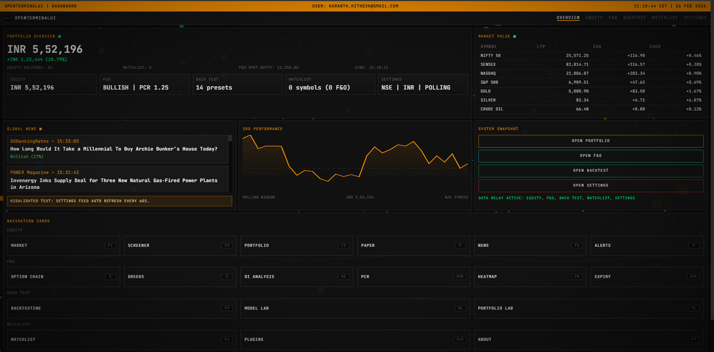
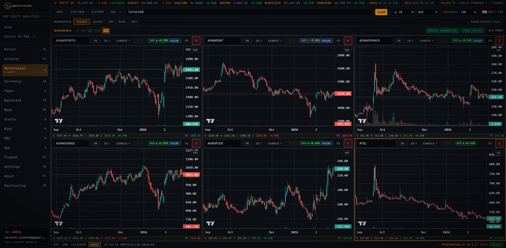
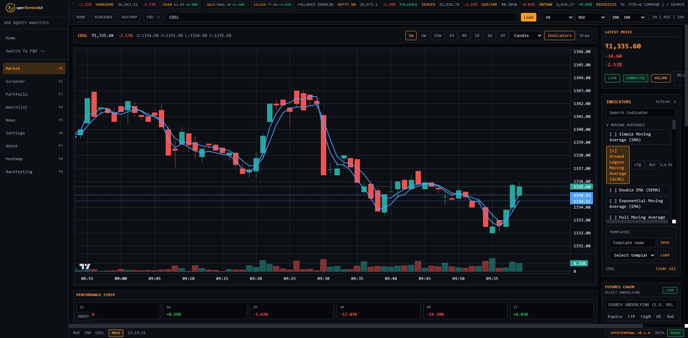
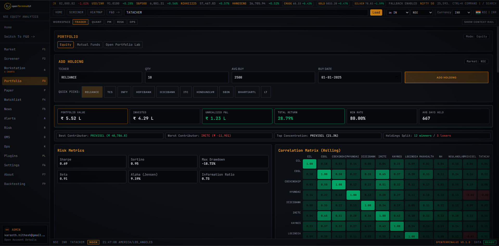
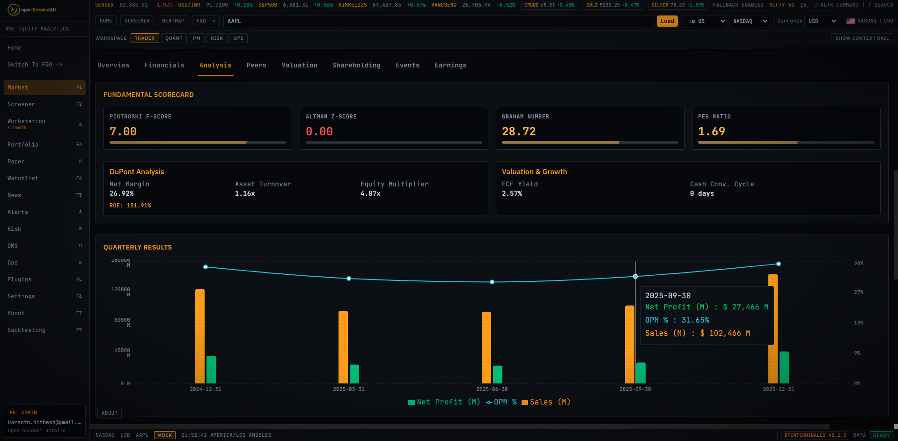
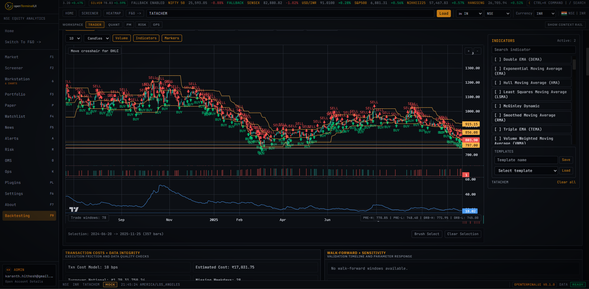

# OpenTerminalUI

<p align="center">
  
</p>

<p align="center">
  <strong>Analyze. Trade. Optimize.</strong><br />
  Open-source terminal-style trading and research workspace for India (NSE/BSE) and US (NYSE/NASDAQ) markets.
</p>

<p align="center">
  <a href="https://github.com/Hitheshkaranth/OpenTerminalUI/actions/workflows/ci.yml"></a>
  
  
  
  
  
  
  
  
  
  
  
  
  
</p>

---

## What is OpenTerminalUI?

OpenTerminalUI is a Bloomberg-style, keyboard-first financial terminal built as an open-source full-stack application. It combines a **FastAPI + Python** backend with a **React + TypeScript** frontend to deliver real-time market data, charting, portfolio analytics, derivatives analysis, backtesting, and risk management in a unified terminal workspace.

Designed for **traders, quant researchers, portfolio managers, risk analysts, and operations teams** working across Indian and US equity markets.

---

## Screenshots

<p align="center">
  <br />
  <em>Dashboard with real-time tickers, market indices, and sector heatmaps</em>
</p>

<p align="center">
  <br />
  <em>Multi-chart workstation with linked crosshairs and technical indicators</em>
</p>

<p align="center">
  <br />
  <em>Stock screener with custom filters and real-time data</em>
</p>

<p align="center">
  <br />
  <em>Portfolio monitoring with allocation analysis and performance tracking</em>
</p>

<p align="center">
  <br />
  <em>Fundamental analysis with financial statements and valuation metrics</em>
</p>

<p align="center">
  <br />
  <em>Backtesting lab with strategy simulation and performance reports</em>
</p>

---

## Features

### Terminal Shell
- **GO bar** (`Ctrl+G`) for instant ticker/command routing
- **Command palette** (`Ctrl+K`) with fuzzy search and keyboard navigation
- Ticker tape, status bar with market clock, and sidebar navigation
- Semantic theme tokens with dark terminal aesthetic

### Equity & Market Intelligence
- Security Hub with chart, fundamentals, technicals, and news in tabbed views
- Chart Workstation with multi-panel layouts and linked crosshair sync
- Volume Profile overlay with VPOC and value-area lines
- Screener with AST-based expression engine (no `eval`)
- Watchlist management with real-time quote updates
- Portfolio tracking and mutual fund mode

### Derivatives (F&O)
- Option chain with Greeks, OI, IV surface, and heatmaps
- PCR analysis, expiry views, and strategy builders
- Futures analytics with consistent terminal routing

### Quant & Backtesting
- Model Lab for strategy backtesting with experiment tracking
- Portfolio Lab for blend analysis and multi-strategy comparison
- Run reports, compare pages, and governance workflows

### Crypto & Macro
- Crypto workspace with charts, movers, and heatmaps
- Economics dashboards with yield curve visualization
- Sector rotation and split comparison tools

### Risk & Operations
- VaR, CVaR, stress testing, and scenario analysis
- OMS blotter with compliance dashboards
- Alert channels with WebSocket-driven real-time updates

### Data Pipeline
- Provider registry with deterministic fallback and health-aware ordering
- Adapters: Kite Connect, Finnhub, yfinance, FMP, NSEPython, Polygon
- OHLCV caching with candle aggregation
- Redis pub/sub quote bus (graceful in-memory fallback)

---

## Architecture

```
┌──────────────────────────────────────────────────────────────┐
│                     Frontend (React 18)                      │
│  Vite  ·  TypeScript  ·  Tailwind CSS  ·  Zustand  ·  cmdk  │
│  TanStack Query  ·  Lightweight Charts  ·  Recharts  ·  D3  │
│  React Router v6  ·  React Grid Layout  ·  ReactFlow        │
└────────────────────┬──────────────────┬──────────────────────┘
                     │  REST + WS       │
┌────────────────────▼──────────────────▼──────────────────────┐
│                    Backend (FastAPI)                          │
│  Python 3.11  ·  SQLAlchemy  ·  Pydantic  ·  Redis           │
│  APScheduler  ·  WebSockets  ·  httpx  ·  pandas  ·  numpy   │
├──────────────────────────────────────────────────────────────┤
│  Providers: Kite · Finnhub · yfinance · FMP · NSEPython      │
│  Services:  MarketDataHub · CandleAggregator · OHLCVCache    │
│  Compute:   Screener · Risk · Backtesting · Portfolio Lab     │
└──────────────────────────────────────────────────────────────┘
```

---

## Repository Structure

```
backend/                  FastAPI app, services, providers, tests
  api/routes/             REST and WebSocket endpoints
  providers/              Market data provider adapters
  services/               Core business logic (candle, risk, backtest)
  screener/               AST-based screener engine
  db/                     Database models, OHLCV cache, migrations
  tests/                  257 pytest tests with coverage enforcement
frontend/                 React app with terminal UI
  src/components/         UI components (layout, terminal, charts)
  src/pages/              Route pages (equity, fno, crypto, etc.)
  src/shared/             Shared chart logic and data transforms
  src/stores/             Zustand state management
  src/__tests__/           92 Vitest unit tests
  tests/e2e/              24 Playwright E2E tests
plugins/                  Plugin extension points
config/                   Runtime configuration
data/                     Fixtures and market reference data
docs/                     Architecture documentation
.github/workflows/        CI pipeline (pytest + Vitest + Playwright)
```

---

## Quick Start

### Docker (recommended)

```bash
git clone https://github.com/Hitheshkaranth/OpenTerminalUI.git
cd OpenTerminalUI
docker compose up -d --build
```

Backend: `http://localhost:8000` | Frontend: `http://localhost:5173`

### Local Development

**Backend:**

```bash
python -m venv .venv
source .venv/bin/activate  # or .\.venv\Scripts\Activate.ps1 on Windows
pip install -r backend/requirements.txt
uvicorn backend.main:app --reload --port 8000
```

**Frontend:**

```bash
cd frontend
npm ci
npm run dev
```

### Environment Variables

Copy `.env.example` to `.env` and configure your API keys:

```bash
cp .env.example .env
```

Required for live data: Kite Connect, Finnhub, FMP, or Polygon API keys. The app runs with mock/cached data when keys are not configured.

---

## Testing

```bash
# Backend (257 tests, 45% coverage threshold)
PYTHONPATH=. pytest backend/tests -q --cov=backend --cov-fail-under=45

# Frontend unit tests (92 tests)
cd frontend && npm test

# E2E tests (24 tests, Chromium + Mobile)
cd frontend && npx playwright install --with-deps chromium
cd frontend && npm run test:e2e
```

---

## CI Pipeline

The GitHub Actions workflow (`.github/workflows/ci.yml`) enforces on every push and PR:

| Gate | Tool | Threshold |
|------|------|-----------|
| Backend compile check | `python -m compileall` | Zero errors |
| Backend test suite | pytest | 257 tests, 45% coverage |
| Frontend build | `tsc + vite build` | Zero errors |
| Frontend unit tests | Vitest | 92 tests passing |
| E2E browser tests | Playwright (Chromium) | 24 tests passing |

---

## Tech Stack

| Layer | Technologies |
|-------|-------------|
| **Frontend** | React 18, TypeScript, Vite 6, Tailwind CSS 3, Zustand, TanStack Query, Lightweight Charts, Recharts, D3, cmdk, React Router v6, ReactFlow |
| **Backend** | Python 3.11, FastAPI, SQLAlchemy, Pydantic, Redis, APScheduler, httpx, pandas, NumPy |
| **Data Providers** | Kite Connect, Finnhub, yfinance, FMP, NSEPython, Polygon |
| **Quant/ML** | XGBoost, statsmodels, Optuna, HMMLearn, empyrical |
| **Testing** | pytest, Vitest, Playwright, Testing Library |
| **Infrastructure** | Docker, GitHub Actions CI, WebSocket, Redis pub/sub |

---

## Contributing

1. Fork the repository
2. Create a feature branch (`git checkout -b feature/my-feature`)
3. Ensure all tests pass (`pytest`, `npm test`, `npm run test:e2e`)
4. Commit your changes and open a pull request

---

## License

MIT. See [LICENSE](LICENSE).
