<div align="center">


### The open-source research terminal for equities, derivatives and quant work

Bloomberg-style workflows, primary-document intelligence and a tool-using AI analyst, self-hosted on your own hardware.

<p>
  
  
  
  
  
  
  
</p>

<p>
  <a href="#-quick-start"><b>Quick start</b></a> ·
  <a href="#-feature-tour"><b>Feature tour</b></a> ·
  <a href="#-what-you-can-do-with-it"><b>Workflows</b></a> ·
  <a href="#-architecture"><b>Architecture</b></a> ·
  <a href="#-ai-models"><b>AI models</b></a> ·
  <a href="https://hitheshkaranth.github.io/OpenTerminalUI/"><b>Website</b></a>
</p>

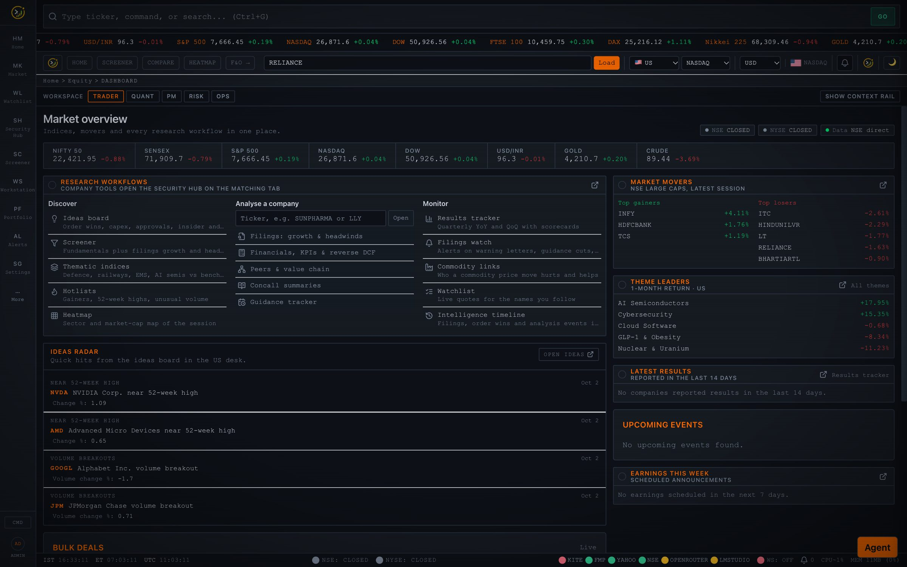

</div>

---

## Why OpenTerminalUI

Most retail tools stop at price charts and ratios. OpenTerminalUI is built for the research that actually moves a position: reading what a company filed, tracking what management promised, mapping who it sells to and buys from, and testing an idea before money goes in.

- **One terminal, many markets.** NSE / BSE, NYSE / NASDAQ, F&O, commodities, forex, crypto, ETFs, bonds and mutual funds, behind a keyboard-first shell (`Ctrl+G` GO bar, `Ctrl+K` palette, `Ctrl+J` agent).
- **Evidence, not vibes.** Filings Intelligence reads 10-Ks, 10-Qs, earnings releases, annual reports and concall transcripts, and every growth engine or headwind it reports carries a verbatim, verified quote with document and page.
- **An analyst that uses tools.** The AI agent calls 40+ read-only tools (snapshots, technicals, filings search, screens, backtests, risk) and answers with the numbers it fetched, not ones it imagined.
- **Honest data.** Every quote carries provenance (`live / delayed / cached / synthetic`), blank metrics say why they are blank, and synthetic fallbacks are labelled, never passed off as real.
- **Yours.** MIT-licensed, self-hosted, works offline-first with free data sources, and runs AI on a local model if you prefer.

---

## 🧭 Feature tour

> Screenshots are captured from the running app once each page has fully loaded (`scripts/capture_readme.mjs`), across a spread of popular stocks.

### Security Hub

A single page per company: DES-style snapshot, interactive price chart with range tabs and hover readout, key ratios, filings signals, reverse DCF and catalyst conviction, with tabs for financials, chart, news, ownership, estimates, peers, ESG, tape, insiders and filings.

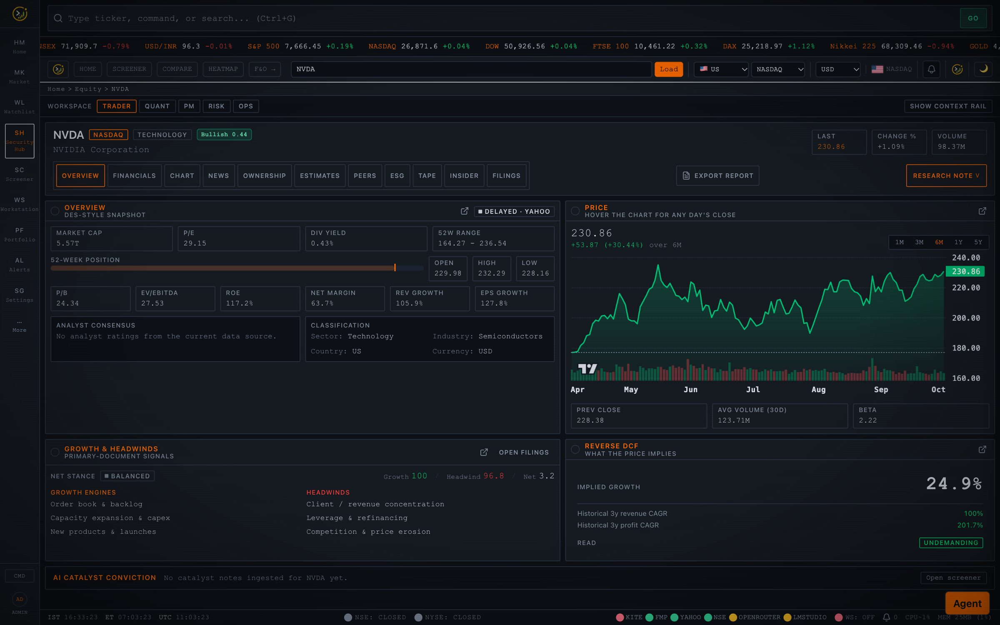

### Filings Intelligence: RAG over company reports

Import a company's primary documents (SEC 10-K / 10-Q / 8-K earnings releases for US listings; annual reports, concall transcripts, investor presentations, order-win and USFDA announcements from NSE) or upload a PDF. The pipeline scores **21 drivers**: growth engines such as order book, new client wins, capacity expansion, approvals and guidance raises, and headwinds such as client concentration, margin pressure, regulatory action and guidance cuts. Every finding is backed by a quote that must appear verbatim in the source, with document and page. You can also ask free-form questions and get cited answers, read concall summaries, and track management guidance over time.

<table>
  <tr>
    <td width="50%">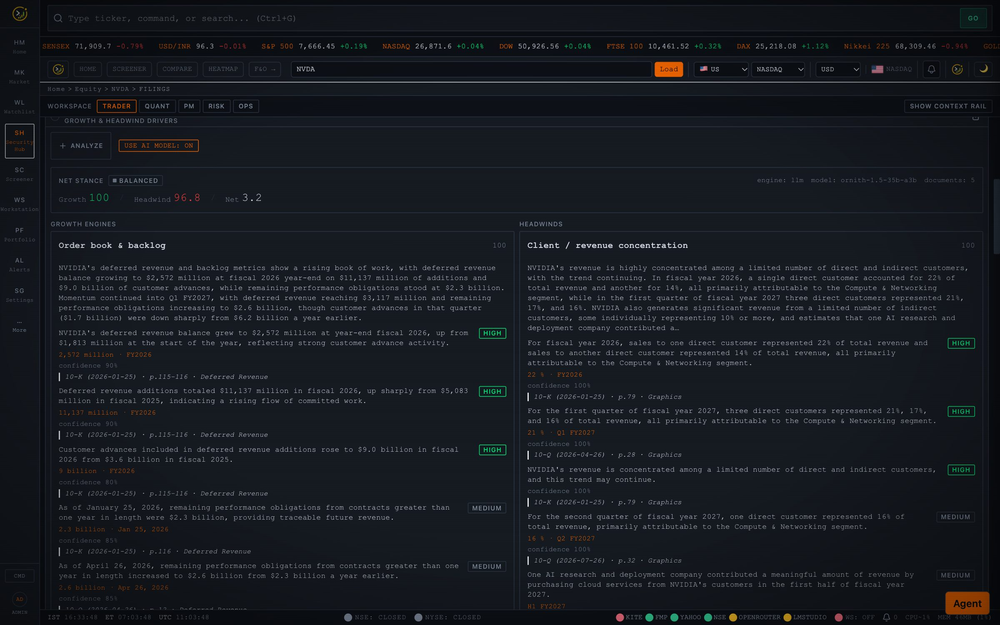</td>
    <td width="50%">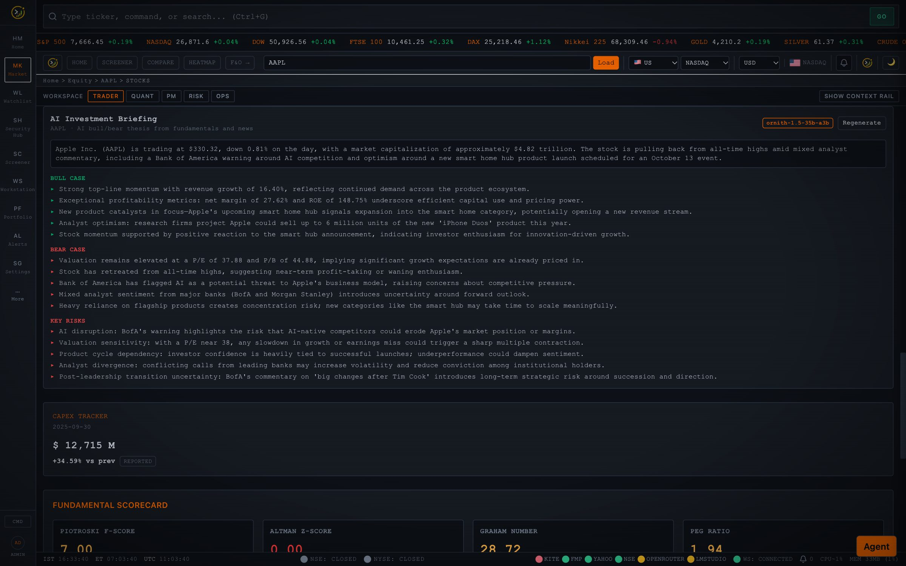</td>
  </tr>
  <tr>
    <td><b>Growth engines vs headwinds</b>: scored drivers, each claim linked to its filing quote and page.</td>
    <td><b>AI investment briefing</b>: a balanced bull / bear / risks read built from fundamentals and live headlines.</td>
  </tr>
</table>

### Business research pack

Tijori-style company research, blended into the Security Hub: operating KPIs extracted from filings and charted over time, revenue mix and market share, a supplier → company → customer **value chain** with every link cited, competitors, raw-material exposure, and a reverse DCF that shows the growth the current price implies.

<table>
  <tr>
    <td width="50%">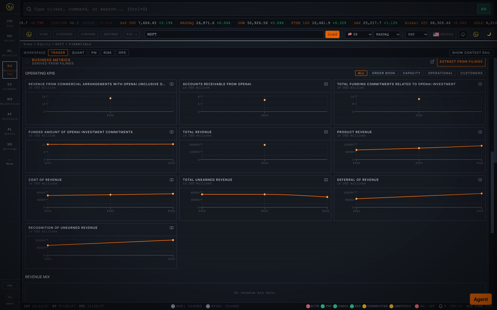</td>
    <td width="50%">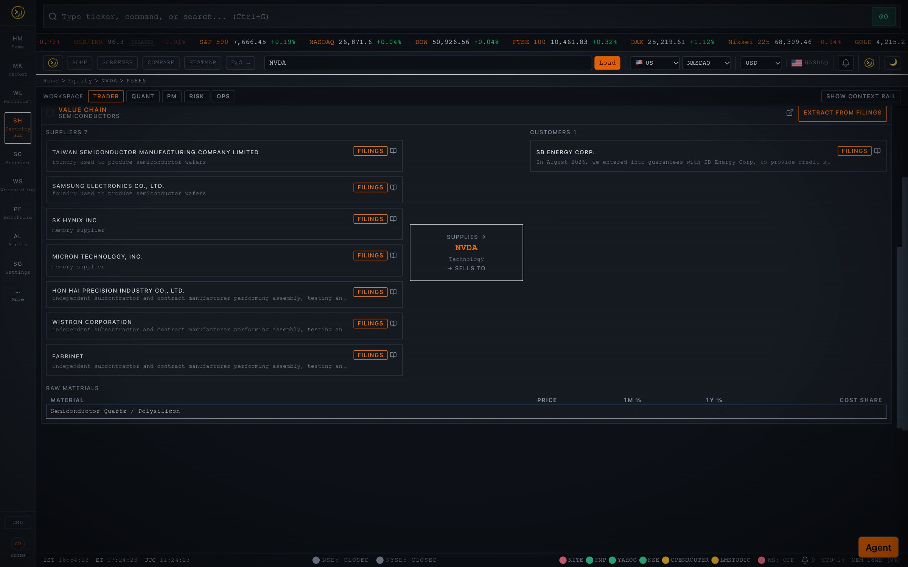</td>
  </tr>
  <tr>
    <td><b>Operating KPIs</b> pulled from filings with quote-level citations (MSFT).</td>
    <td><b>Value chain</b>: NVDA's foundry, memory and assembly suppliers from its 10-K, resolved to listed tickers where they exist.</td>
  </tr>
</table>

### AI research agent

A slide-over console (`Ctrl+J`) that researches on demand. It picks tools, fetches data, and writes the answer from the results, rendering snapshots and tables as cards. Modes include **multi-agent debate** (analyst team → bull vs bear → portfolio-manager decision), **Strategy Lab** (propose → backtest → iterate → out-of-sample validation), **screen membership** and **ensemble** analysis. The same tool registry is exposed as an authenticated **MCP server** for Claude Code, Claude Desktop and other MCP clients.

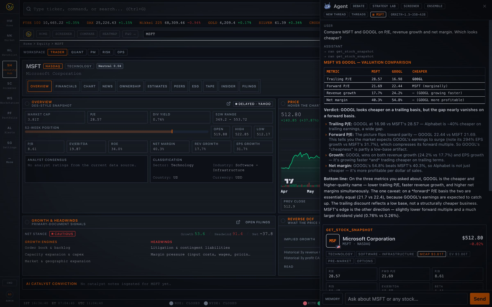

### Markets, charts and discovery

<table>
  <tr>
    <td width="50%">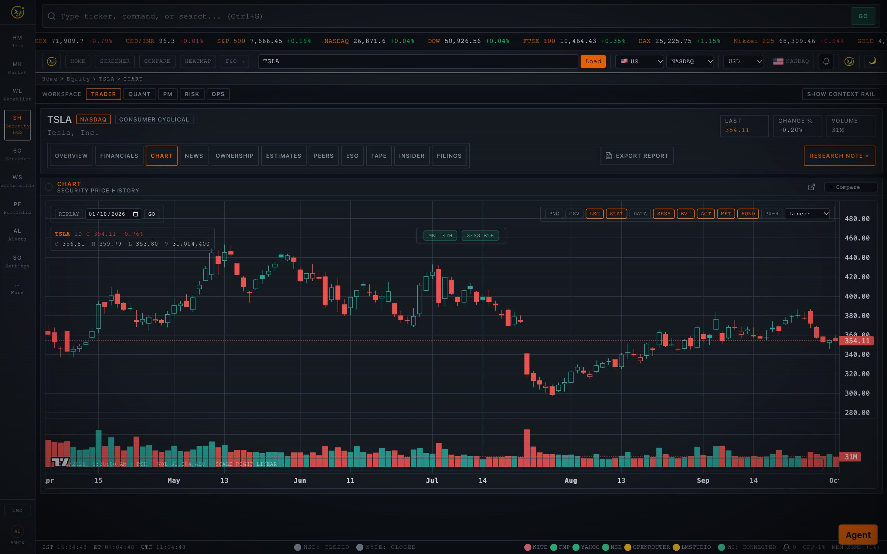</td>
    <td width="50%">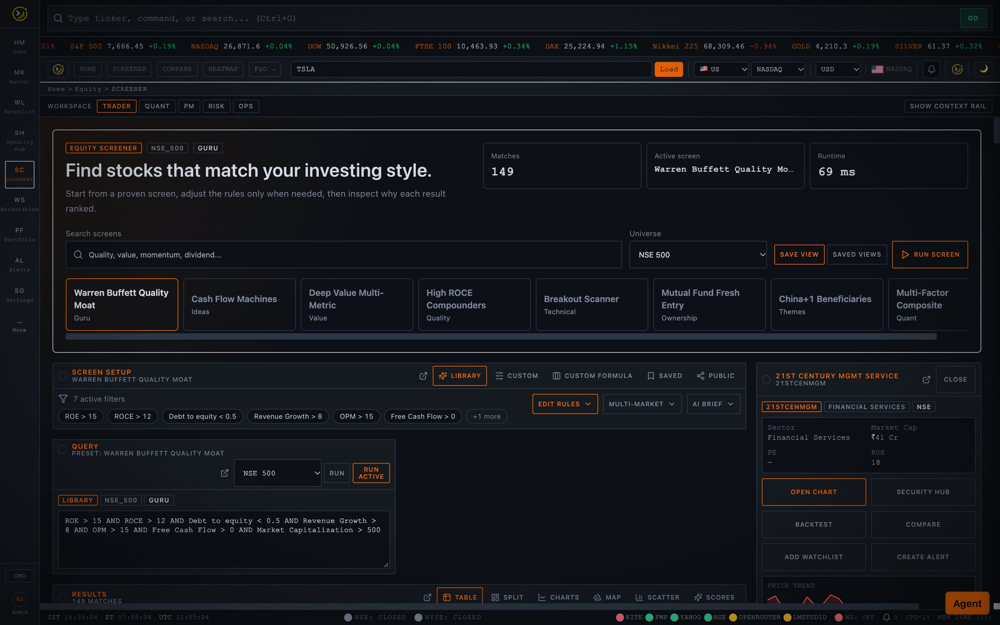</td>
  </tr>
  <tr>
    <td><b>Charting</b>: candles, indicators, drawing tools, multi-timeframe, replay, compare and multi-pane workstations.</td>
    <td><b>Screener</b>: guru and thematic presets, a formula engine, filings-based fields and 15+ visualisations.</td>
  </tr>
  <tr>
    <td>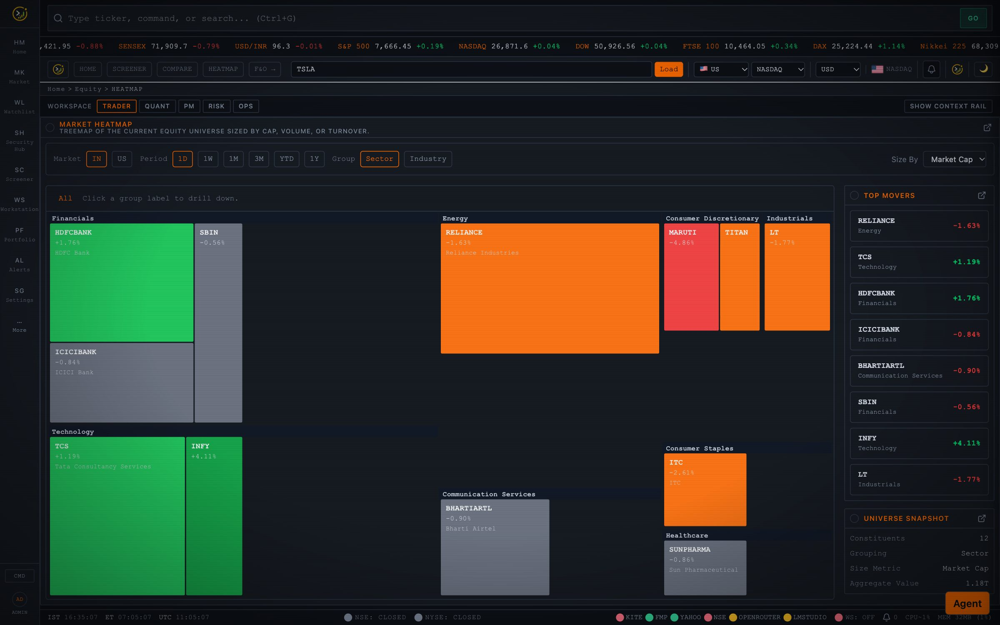</td>
    <td>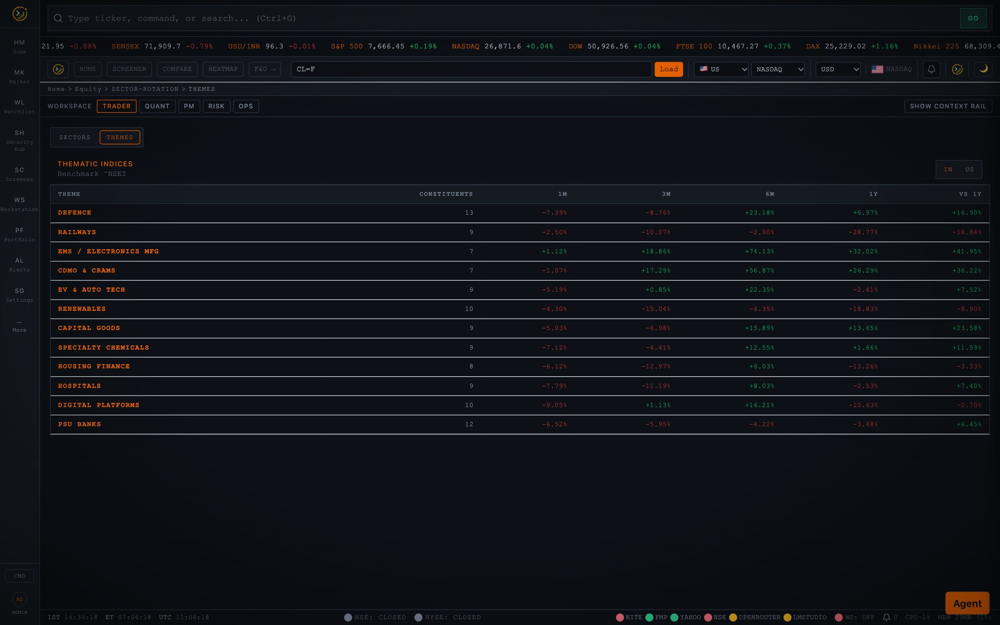</td>
  </tr>
  <tr>
    <td><b>Heatmap</b>: sector and market-cap map of the session, with drill-down and top movers.</td>
    <td><b>Thematic indices</b>: 18 investable themes (defence, railways, EMS, AI semis, GLP-1…) against a benchmark.</td>
  </tr>
</table>

### Derivatives, quant and cross-asset

<table>
  <tr>
    <td width="50%">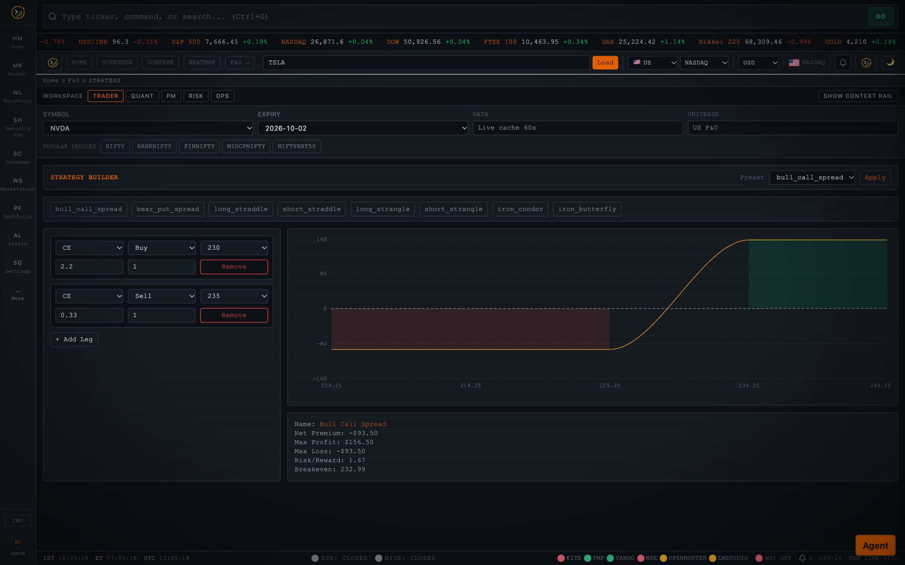</td>
    <td width="50%">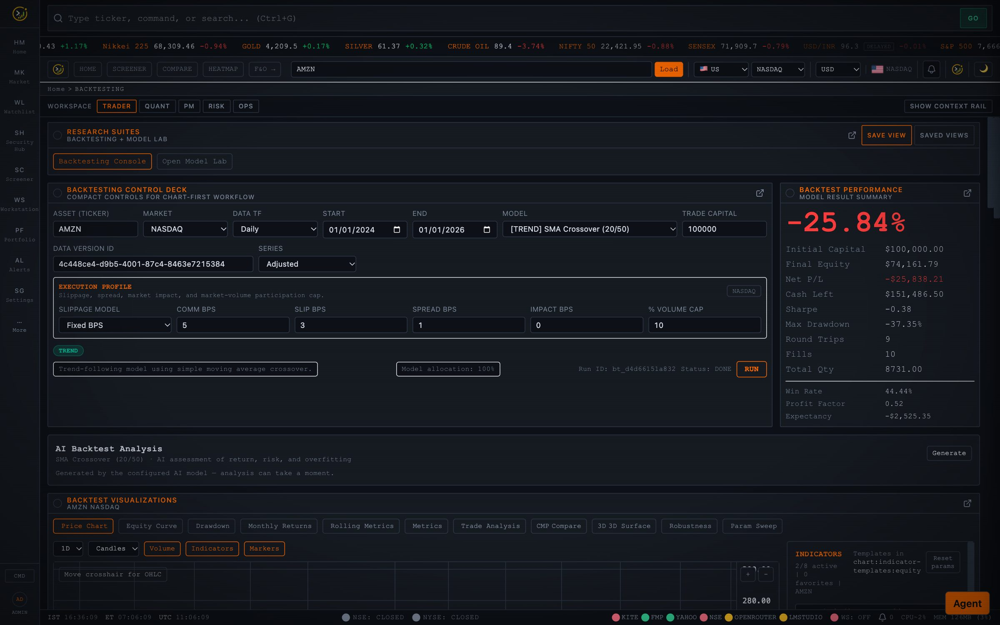</td>
  </tr>
  <tr>
    <td><b>F&amp;O</b>: option chain with Greeks, multi-leg strategy builder, OI and PCR analysis, options flow, futures term structure, expiry calendar.</td>
    <td><b>Backtesting</b>: 16+ strategy templates, realistic execution costs, walk-forward, Monte Carlo, Model Lab and Portfolio Lab.</td>
  </tr>
  <tr>
    <td>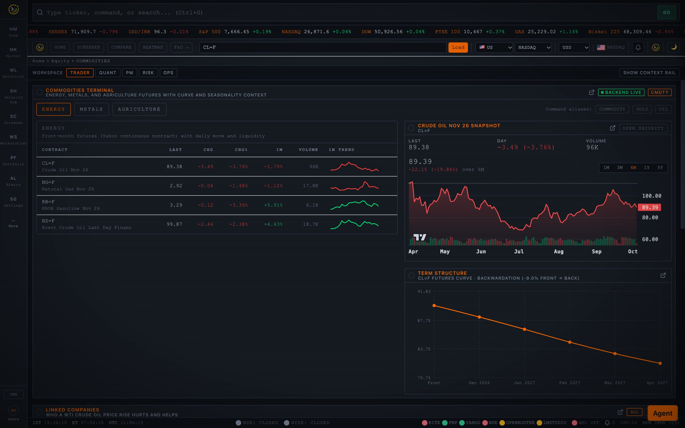</td>
    <td>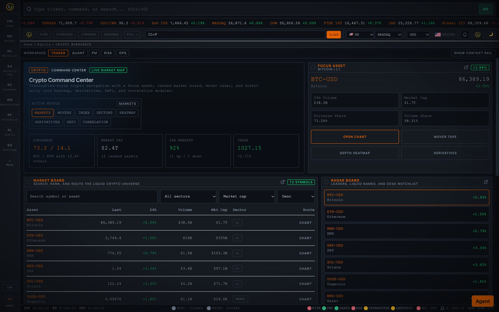</td>
  </tr>
  <tr>
    <td><b>Commodities</b>: energy, metals and agriculture with curves, seasonality, and the listed companies each move hurts or helps.</td>
    <td><b>Crypto</b>: market board, movers, sectors, DeFi, derivatives and correlation.</td>
  </tr>
</table>

### Workspaces

<table>
  <tr>
    <td width="50%">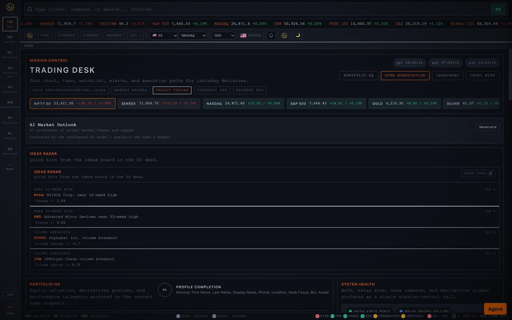</td>
    <td width="50%">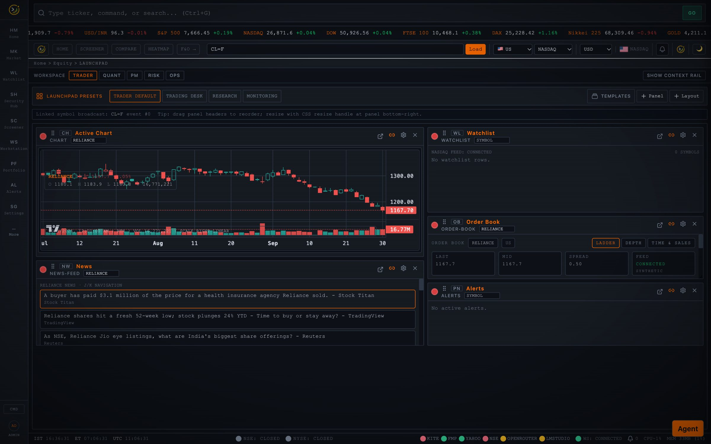</td>
  </tr>
  <tr>
    <td><b>Mission control</b>: workspace presets for Trader, Quant, PM, Risk and Ops desks.</td>
    <td><b>Launchpad</b>: drag-and-drop panels (charts, order book, news, alerts, AI research) with pop-outs and saved layouts.</td>
  </tr>
</table>

<details>
<summary><b>Everything else in the box</b></summary>

| Area | What's included |
|---|---|
| **Portfolio & trading** | Multi-portfolio holdings, Zerodha Kite / CSV import (Zerodha, Groww, generic), allocation and attribution, paper trading with slippage and TCA, trade journal, position sizer, shadow account |
| **Risk** | VaR / CVaR, EWMA volatility, PCA factor exposures, stress scenarios (GFC, COVID, rate shock…), correlation regimes and clustering, exposure heatmaps |
| **Quant research** | Factor dashboard, Alpha Zoo, statistical lab, pair-trading lab, research autopilot, strategy export (Pine / MQL5), model governance |
| **Monitoring** | Ideas board (order wins, capex, approvals, insider and bulk deals), filings watch alerts, results tracker with QoQ / YoY scorecards, earnings calendar, intelligence timeline, events hub |
| **Alerts** | Multi-condition rules with actions on trigger (paper order, watchlist, webhook), delivery to in-app / email / Slack / Telegram / webhook |
| **Macro & fixed income** | Economic calendar, yield curve with inversion detection, bond analytics, forex with central-bank monitor, ETF and mutual fund analytics |
| **Operations** | OMS with restricted lists and audit trail, ops dashboard with kill switches, data-quality console, provider status row |
| **Extensibility** | Plugin system, sandboxed Python scripting, OpenScript custom indicators, saved views, MCP server |

</details>

---

## 🛠 What you can do with it

| Goal | How |
|---|---|
| **Find what's driving a company** | Security Hub → **Filings** → *Fetch* (SEC / NSE) → *Analyze*: scored growth engines and headwinds, each with its source quote |
| **Check management's track record** | **Guidance tracker** compares what was promised quarter over quarter; **concall summaries** give the takeaways with quotes |
| **Ask a question of the filings** | *Ask the filings*: "What did they say about capacity and capex?" gets a cited answer |
| **Map a company's ecosystem** | **Peers → Value chain**: customers and suppliers from filings, resolved to tickers, plus competitors and raw materials |
| **Know when a commodity move matters** | **Commodities → Linked companies**: who gains and who loses when crude, steel or copper moves |
| **Get a second opinion** | Agent console: "Is NVDA above its 52-week midpoint, and how does its P/E compare with AMD?" Or run a **debate** for a bull / bear / PM decision |
| **Generate ideas** | Ideas board, guru screens, thematic indices, hotlists, and filings-based screener fields (e.g. strong order-book signal) |
| **Test before you trade** | Backtest a strategy, validate it walk-forward and with Monte Carlo, then paper trade it |
| **Watch for change** | Filings watch flags new warning letters, guidance cuts or big order wins; alerts fire actions automatically |

---

## 🧱 Architecture

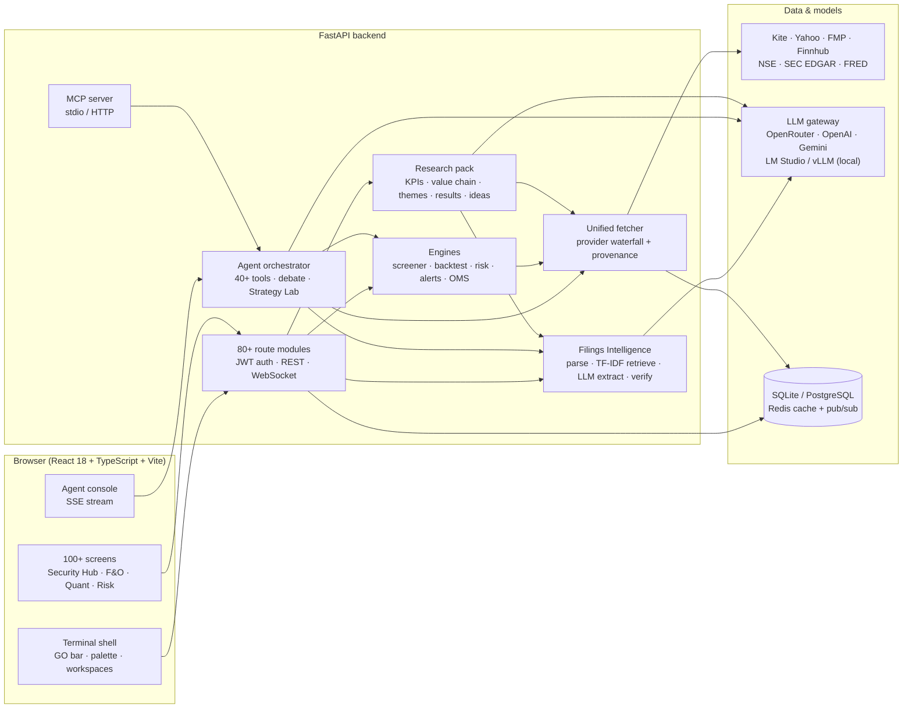
```mermaid
flowchart LR
  subgraph Client["Browser (React 18 + TypeScript + Vite)"]
    UI["Terminal shell<br/>GO bar · palette · workspaces"]
    Pages["100+ screens<br/>Security Hub · F&O · Quant · Risk"]
    AgentUI["Agent console<br/>SSE stream"]
  end

  subgraph API["FastAPI backend"]
    Routes["80+ route modules<br/>JWT auth · REST · WebSocket"]
    Agent["Agent orchestrator<br/>40+ tools · debate · Strategy Lab"]
    MCP["MCP server<br/>stdio / HTTP"]
    Filings["Filings Intelligence<br/>parse · TF-IDF retrieve · LLM extract · verify"]
    Research["Research pack<br/>KPIs · value chain · themes · results · ideas"]
    Engines["Engines<br/>screener · backtest · risk · alerts · OMS"]
    Fetcher["Unified fetcher<br/>provider waterfall + provenance"]
  end

  subgraph Data["Data & models"]
    Providers["Kite · Yahoo · FMP · Finnhub<br/>NSE · SEC EDGAR · FRED"]
    LLM["LLM gateway<br/>OpenRouter · OpenAI · Gemini<br/>LM Studio / vLLM (local)"]
    Store[("SQLite / PostgreSQL<br/>Redis cache + pub/sub")]
  end

  UI --> Routes
  Pages --> Routes
  AgentUI --> Agent
  Routes --> Engines & Research & Filings
  Agent --> Fetcher & Filings & Engines
  MCP --> Agent
  Engines --> Fetcher
  Research --> Filings & Fetcher
  Fetcher --> Providers
  Filings --> LLM
  Agent --> LLM
  Research --> LLM
  Routes --> Store
  Fetcher --> Store
```

**How a request flows.** The React client calls `/api/*` over REST (and WebSockets for live quotes). Market data goes through the **unified fetcher**: L1 SQLite cache → L2 Redis → primary provider → fallback provider, with the serving source recorded as provenance on every response. AI features call one LLM gateway, so swapping OpenRouter for a local model is a configuration change, not a code change.

**Filings Intelligence pipeline**

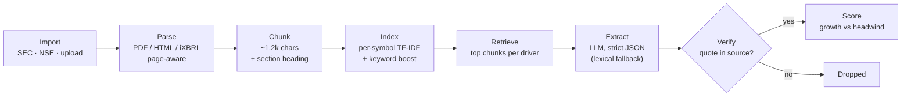
```mermaid
flowchart LR
  A["Import<br/>SEC · NSE · upload"] --> B["Parse<br/>PDF / HTML / iXBRL<br/>page-aware"]
  B --> C["Chunk<br/>~1.2k chars<br/>+ section heading"]
  C --> D["Index<br/>per-symbol TF-IDF<br/>+ keyword boost"]
  D --> E["Retrieve<br/>top chunks per driver"]
  E --> F["Extract<br/>LLM, strict JSON<br/>(lexical fallback)"]
  F --> G{"Verify<br/>quote in source?"}
  G -- yes --> H["Score<br/>growth vs headwind"]
  G -- no --> X["Dropped"]
```

A finding survives only if its quote is found in the cited chunk (exact, or ≥85% token overlap with every number matching verbatim), and only if the model marks it as supporting the driver. Without an LLM, a lexical extractor still works, with results flagged as lower-confidence keyword matches.

<details>
<summary><b>Tech stack</b></summary>

| Layer | Technology |
|---|---|
| Frontend | React 18, TypeScript, Vite, Tailwind CSS, TanStack Query, Zustand, lightweight-charts v5, Recharts, Three.js, Libraries.dev effects (thinking-orbs, border-beam, bot-avatars) |
| Backend | Python 3.11, FastAPI, Uvicorn, SQLAlchemy, Alembic, Pydantic v2, pandas / NumPy, pypdf, BeautifulSoup |
| AI | OpenAI-compatible LLM gateway (OpenRouter, OpenAI, Gemini, LM Studio, vLLM), MCP server, TF-IDF retrieval |
| Data | SQLite (default) or PostgreSQL 16, Redis 7 cache and pub/sub |
| Testing | pytest (1,400+ backend tests), Vitest (~600 frontend tests), Playwright end-to-end |
| Delivery | Docker multi-stage image (published to GHCR on release), one-command installer |

</details>

---

## 🚀 Quick start

```bash
git clone https://github.com/Hitheshkaranth/OpenTerminalUI.git
cd OpenTerminalUI
./install.sh          # macOS / Linux / WSL   (Windows: ./install.ps1)
```

The installer detects your OS, creates `.env` with strong generated secrets, seeds an admin account with a unique password, uses **Docker if available, otherwise a local Python + Node setup**, and prints your login:

```
 OpenTerminalUI is ready  ->  http://localhost:8000
   email:    admin@openterminal.local
   password: <generated unique password>
```

**Prerequisites:** Docker, *or* Python 3.11+ and Node 20+. All API keys are optional; the app runs on free fallback sources.

<details>
<summary><b>Docker by hand</b></summary>

```bash
cp .env.example .env
docker compose up --build                       # backend + frontend + Redis (SQLite)
docker compose --profile postgres up --build    # with PostgreSQL
```
</details>

<details>
<summary><b>Local development (hot reload)</b></summary>

```bash
python3.11 -m venv .venv && source .venv/bin/activate
pip install -r backend/requirements.txt
PYTHONPATH=. uvicorn backend.main:app --reload --port 8000

cd frontend && npm ci && npm run dev          # http://127.0.0.1:5173
```
</details>

**Adding data keys:** run `make keys` for a guided wizard, or (as an admin) use **Settings → Data Providers** in the app to set, test and clear keys live.

| Key | Unlocks |
|---|---|
| `FMP_API_KEY` | US fundamentals, earnings, peers |
| `FINNHUB_API_KEY` | US real-time WebSocket ticks |
| `KITE_API_KEY` / `KITE_API_SECRET` / `KITE_ACCESS_TOKEN` | India NSE / BSE real-time and history, holdings import |
| `FRED_API_KEY` | Macro series |
| `OPENROUTER_API_KEY` | Hosted LLMs for the agent and AI features |

---

## 🤖 AI models

Every AI feature (agent, briefings, filings analysis, Q&A, concall summaries, KPI and value-chain extraction, news emotion) goes through one gateway. Pick a provider:

| Setup | Configuration |
|---|---|
| **Hosted (OpenRouter)** | `AGENT_PROVIDER=openrouter`, `OPENROUTER_API_KEY=…`, `AGENT_MODEL=<model id>` |
| **Local (LM Studio)** | `AGENT_PROVIDER=lmstudio`, `LM_STUDIO_BASE_URL=http://localhost:1234/v1`, `LM_STUDIO_MODEL=<model id>` |
| **Self-hosted gateway (vLLM etc.)** | As LM Studio, plus `LM_STUDIO_API_KEY=…` if the gateway requires a bearer token |

| Variable | Default | Purpose |
|---|---|---|
| `AGENT_MAX_TOKENS` | `4096` | Per-turn budget for the agent. Reasoning models need room to think *and* answer. |
| `AGENT_FALLBACK_MODELS` | – | Comma-separated models tried when the primary is rate-limited or unavailable |
| `LM_STUDIO_ENABLED` | `true` | Master switch for the local-model path |
| `OPENTERMINALUI_LM_STUDIO_TIMEOUT_SECONDS` | `240` | Per-request timeout for slow local models (also `lm_studio_timeout_seconds` in `backend/config/settings.yaml`) |
| `FILINGS_WATCH_ENABLED` | `true` | Background polling for new filings and alerts |

Reasoning models are supported: structured (JSON) calls disable thinking via `chat_template_kwargs` on local servers, so the token budget goes to the answer. If no model is reachable, features fall back to deterministic engines (lexical filings extraction, FinBERT / lexical sentiment) and say so in the UI.

---

## 📁 Project structure

```
backend/                FastAPI app
  api/routes/           REST route modules (equity, F&O, backtest, risk, OMS, providers…)
  agent/                AI agent: orchestrator, tool registry, debate, Strategy Lab
  mcp/                  MCP server (stdio / HTTP) over the agent tools
  filings_rag/          Filings Intelligence: sources, parsing, retrieval, analysis, knowledge
  filings_watch/        Background watcher that turns new filings into alerts
  business_metrics/     KPI, revenue-mix and market-share extraction
  value_chain/          Suppliers / customers / competitors / raw materials
  thematic_indices/     Theme baskets and benchmark-relative performance
  ideas/ results_tracker/ raw_materials/ peer_kpis/ valuation/   Research pack
  core/                 Unified fetcher, providers, backtesting, risk, technicals
  pure_jump_vol/        Pure-jump volatility model (fit, filter, signals)
  services/ shared/     LLM gateway, caching, DB session, market classifier
  tests/                pytest suite
frontend/               React + Vite SPA
  src/pages/            Screens
  src/components/       Terminal design system and feature components (incl. ai/AiVisuals)
  src/agent/            Agent console, SSE client, artifact rendering
  src/api/              Typed API clients
  tests/e2e/            Playwright specs
plugins/                Example plugins
scripts/                Installer helpers, screenshot capture, PJV research CLI (scripts/pjv)
packaging/windows/      PyInstaller build for a Windows desktop executable
docs/                   Architecture notes, guides and design docs
assets/                 Logo and README screenshots
```

---

## ✅ Testing

```bash
PYTHONPATH=. pytest backend/tests -q            # backend
cd frontend && npx vitest run && npm run build  # frontend unit tests + type-checked build
cd frontend && npm run test:e2e                 # Playwright end-to-end
make gate                                       # backend tests + frontend build
```

Re-capture the README screenshots from a running instance:

```bash
cd frontend && OT_BASE=http://127.0.0.1:8000 OT_TOKEN_FILE=/path/to/jwt.txt node ../scripts/capture_readme.mjs
```

## ⌨️ Keyboard shortcuts

| Keys | Action |
|---|---|
| `Ctrl+G` | GO bar: symbols, commands and natural-language questions |
| `Ctrl+K` | Command palette |
| `Ctrl+J` | Toggle the AI agent console |
| `F1`–`F9` | Switch workspaces |
| `1`–`7` | Chart timeframes |
| `Esc` | Close the active panel |

## 🤝 Contributing

Contributions are welcome. See [CONTRIBUTING.md](CONTRIBUTING.md). Branch as `feat/…` or `fix/…`, add tests with the change, run `make gate`, and open a PR with a clear description.

## 📄 License

[MIT](LICENSE). Free to use, modify and distribute, including commercially.

<div align="center"><sub>Market data is provided by third-party sources and may be delayed. Nothing in this software is investment advice.</sub></div>
